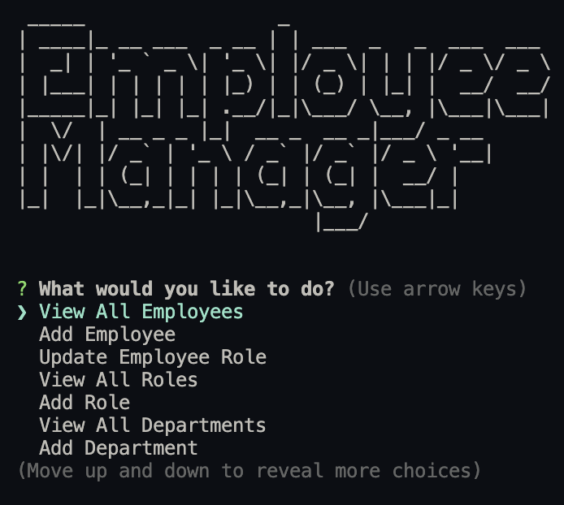
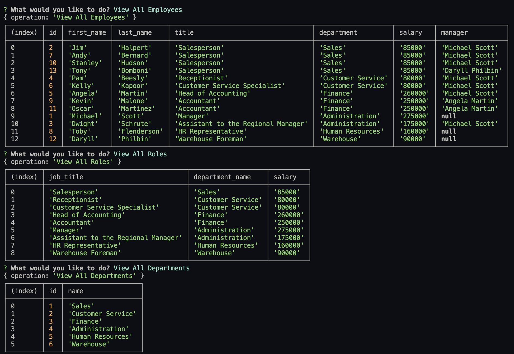
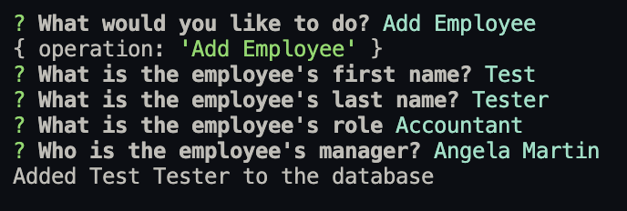
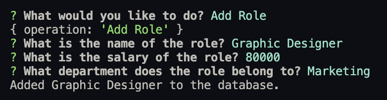
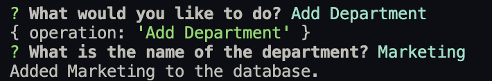
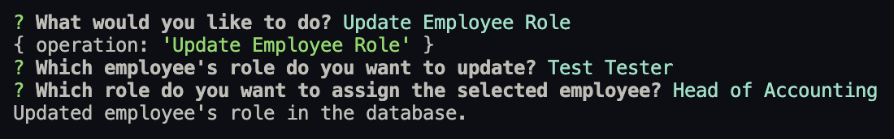
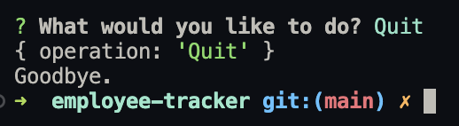

# Employee Tracker
  
  ##### Table of Contents  
  [Description](#description)  
  [Installation](#installation)  
  [Usage](#usage)  
  [Contributions](#contributions)   
  [Questions](#questions)  
  [License](#license)

## Description
This application is a Content Management System for a business. The goal of the project is to provide a program to help a business owner access and organize data pertaining to their employees in database. This is accomplished through the use of Node.js, and Inquirer to gather user inputs and MySQL to store the data into tables that can be accessed through database queries.
## Installation

Run the following command to install the required dependencies.

```
npm i
```

## Usage

To use the application run the command 'node index.js'. The program will ask for a selection from the list of available options. Use the arrow keys to scroll through the choices and press 'Enter' to select an option. 
   

The ```View All Employees```, 
```View All Roles```, and 
```View All Departments``` options will print out tables in the terminal with the current respective information. After displaying a table, the program will return to the initial user prompts.   


The 
```Add Employees```,
```Add Role```,
```Add Department``` options will prompt the user to input information regarding the selected operation. Respond to each prompt accordingly to add information to the database. After successfully adding information to the database, the program will return to the initial user prompts.  
  
  
  

Selecting the ```Update Employee Role``` option will allow the user to change the role of an employee within the database, by following the prompts. Again, the program will return to the intial user prompts after updating the database info.  


Selecting the ```Quit``` option will terminate the program.  


## Video Demo

A video walkthrough of this application can be found here:

https://drive.google.com/file/d/1ogI1H8yBaPHsIV_L_eO1aryUfKFenUKd/view?usp=sharing

## Contributions

Stack Overflow user [Code Magician](https://stackoverflow.com/users/877097/code-magician): [MySQL Multiple Joins in One Query](https://stackoverflow.com/questions/8974328/mysql-multiple-joins-in-one-query)


## Questions

For any questions regarding the repository, contact me via:

- Github: [dgomie](https://www.github.com/dgomie)
- Email: <a href="mailto:danny.f.gomez@gmail.com">danny.f.gomez@gmail.com</a>

## License
